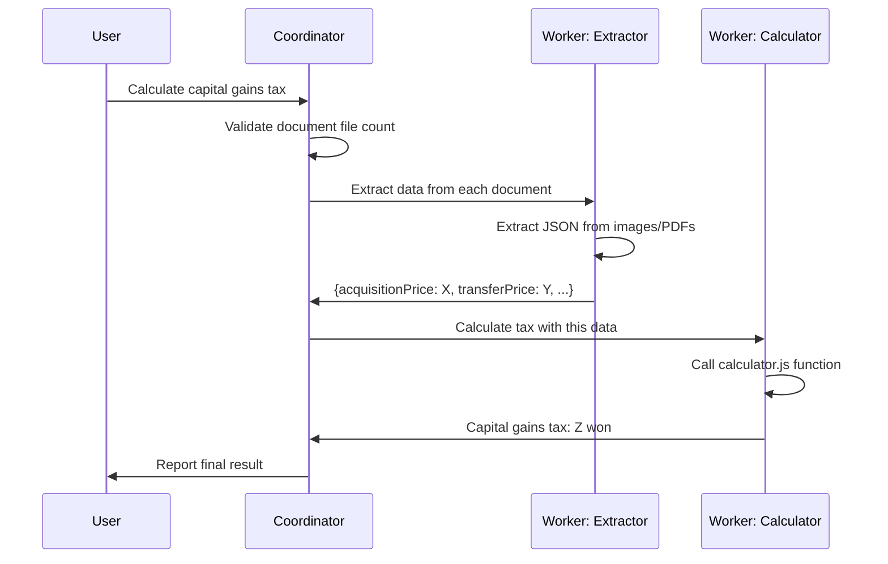

An AI that was answering "10 million won" to the correct answer of 4.25 million won now consistently answers "4.25 million won" after implementing the coordinator-worker pattern. This article is based on experience building a capital gains tax calculation system using CrewX during the Zero100 AI Builderthon.

<!--truncate-->

**This article will help if you:**
- Are frustrated with LLM calculation errors
- Want to build a multi-agent system for the first time
- Find LangGraph/AutoGen overly complex

## Project Background

This project started during the **Zero100 AI Builderthon**.

I partnered with a **practicing tax accountant** in South Korea. The accountant explained the complex business logic and edge cases of capital gains tax calculation, while I implemented it as a multi-agent system using CrewX.

Initially, I attempted with a single AI agent, but ran into issues with inconsistent results. Then, when we **separated responsibilities into 3 specialist agents**, the accuracy improved dramatically—even team members were amazed.

> "Now it's accurate down to the ten-thousand won! This actually works?" — Team member's reaction

This article shares the key insight learned in that process: **"Specialization increases accuracy."**

## TL;DR

| Item | Single Agent | 3-Agent Specialization |
|------|-------------|---------------------|
| **Accuracy** | Best case: 4.21 million won (correct: 4.25 million) | Accurate to ten-thousand won (4.25 million) |
| **Wrong answer probability** | 20~30% produce nonsensical answers (e.g., 10 million) | Nearly none |
| **Result consistency** | Varies each time (70~80%) | 99% consistent results |
| **Debugging** | No idea where it failed | Traceable step-by-step |

## Problem: Single Agent Limitations

Capital gains tax calculation is complex:
- Extract acquisition price, transfer price, and expenses
- Apply long-term holding deduction
- Calculate tax rate and final tax amount

When we delegated everything to a single AI:

```
❌ Problem 1: Information confusion
   - Confuses acquisition price with transfer price
   - Incorrectly matches numbers from multiple documents

❌ Problem 2: Calculation errors
   - LLM direct calculation fails at the one-won level
   - Mistakes occur in complex deduction calculations

❌ Problem 3: Result inconsistency
   - Different answers to the same question
   - Unreliable output
```

## Solution: Coordinator-Worker Pattern with 3 Specialized Agents

### Architecture: Coordinator-Worker Pattern



### 1. Coordinator
- **Role**: Orchestrates the entire workflow and delegates tasks to worker agents
- **Core principle**: Never calculate directly, only coordinate
- **Responsibilities**:
  - Validate document file count
  - Delegate tasks to appropriate worker agents
  - Combine final results from workers

### 2. Worker Agent: Extractor
- **Role**: Convert unstructured data → structured JSON
- **Core principle**: Don't judge (extract only what's visible)
- **Responsibilities**:
  - Extract numbers from images/PDFs
  - Categorize by item (acquisition price, transfer price, etc.)
  - Output in JSON format

### 3. Worker Agent: Calculator
- **Role**: Accurate tax calculation
- **Core principle**: Exclude LLM hallucinations, calculate via code
- **Responsibilities**:
  - Call `calculator.js` functions
  - Accurate calculation to the one-won level
  - Explicitly show calculation basis

## Results: Accuracy and Consistency Achieved

**Test case: Capital gains tax of 4.25 million won (correct answer)**

### Before (Single Agent)
```
Attempt 1: 4.21 million won ← Best case (40,000 won error)
Attempt 2: 4.38 million won ← Different result
Attempt 3: 10 million won ← Nonsensical answer (occurs 20~30% of the time)
```
- Only 70~80% produce somewhat close answers
- 20~30% are completely wrong
- **Different results each time** → Unreliable

### After (Coordinator-Worker Pattern)
```
Attempt 1: 4.25 million won ← Correct
Attempt 2: 4.25 million won ← Same
Attempt 3: 4.27 million won ← Occasionally 20,000 won error
```
- **99% consistent results**
- Accurate to the ten-thousand won level
- Nonsensical answers nearly eliminated

**Key insight**: The coordinator-worker pattern with specialized worker agents dramatically improved stability and accuracy.

## Why We Chose CrewX

### The core point: Production-ready coordinator-worker prototype in 3 days

**A complete prototype of the coordinator-worker pattern was built in just 3 days.**

This is the true power of CrewX:
- Day 1: Start validating the idea "Will the coordinator-worker pattern improve accuracy?"
- Day 2: Set up Coordinator and Worker agents (Extractor, Calculator) + connect Skills
- Day 3: Test in Slack → **"This actually works!"** Confirmed

**In 3 days, you can know "will it work or not?"** If not, you try another approach. If it does, you iterate on it. This fast experimentation cycle ultimately led to success.

### What if we built this with LangGraph?

Honestly, **a prototype in 3 days?** Nearly impossible.

```
Day 1: Reading LangChain documentation... Understanding graph theory...
Day 2: Define Tool schemas... Pydantic errors...
Day 3: First agent still not working
Day 4-7: Finally single agent operational
Day 8-14: Implementing coordinator-worker pattern... Complex state management...
Day 15+: Server deployment... Docker setup... API endpoints...
```

**After 2 weeks, you'd know "will it work?"** If not, you wasted 2 weeks.

### Full development timeline: Production-level in 3 weeks

This project was completed **in 3 weeks during the Zero100 AI Builderthon**:
- Week 1: Idea validation + coordinator-worker prototype (3 days) + feedback incorporation
- Week 2: Skill enhancement + Slack Bot integration + tax accountant testing
- Week 3: Accuracy tuning + presentation prep

**Thanks to CrewX, we confirmed "this works" in the first week**, then spent the remaining 2 weeks improving completeness.

### CrewX Skills: A Tool Call Revolution

To implement Tool Call in LangGraph:

```python
# LangGraph: Just defining a tool requires this complexity
from langchain.tools import tool
from pydantic import BaseModel, Field

class TaxCalculatorInput(BaseModel):
    acquisition_price: int = Field(description="Acquisition price")
    transfer_price: int = Field(description="Transfer price")
    holding_years: int = Field(description="Holding period")
    # ... Defining dozens of fields

@tool
def calculate_tax(input: TaxCalculatorInput) -> dict:
    # Complex calculation logic...
    # Error handling...
    # API server deployment...
    pass

# Code to connect to graph...
# Error handling layer...
# Retry logic...
```

**CrewX Skills done with a single markdown file:**

```markdown
# skills/tax-calculator/SKILL.md
---
name: tax-calculator
description: Capital gains tax calculation skill
---

## Usage
Call functions from calculator.js to calculate accurate taxes.
Don't let the LLM calculate directly; use this skill.
```

```javascript
// skills/tax-calculator/calculator.js
function calculateTax(acquisitionPrice, transferPrice, holdingYears) {
  // Accurate calculation to the one-won level
  return result;
}
```

**That's it.** No server deployment needed, test locally and immediately integrate with Slack.

### Development Time Comparison

| Item | LangGraph | CrewX |
|------|-----------|-------|
| **Add one Tool/Skill** | Half day to 1 day (schema, error handling, deployment) | **30 minutes** (Markdown + JS) |
| **Prototype** | 2~4 weeks | **2~3 days** |
| **Production level** | 1~3 months | **1~2 weeks** |
| **Test after modification** | Wait for Docker rebuild... | **Immediate** (local run) |

### Learning Curve Comparison

| Item | LangGraph | CrewX |
|------|-----------|-------|
| **Target** | Professional developers (Python required) | **Anyone can use** |
| **Prerequisites** | LangChain + graph theory + state management | YAML syntax only |
| **Initial entry** | 1~2 weeks of learning | **30-minute tutorial** |
| **Production proficiency** | 2~3 months | **1~2 weeks** |
| **Debugging** | Difficult due to abstraction layers | **Step-by-step tracing possible** |

In this project, **the tax accountant tested the agents directly in Slack** and provided feedback. With LangGraph, we would have needed to request "modify the code and redeploy for me."

### API Cost Comparison

| Scenario | LangGraph (direct API calls) | CrewX (leverage existing subscription) |
|----------|--------------------------|---------------------|
| **100 uses/month** | $50~150/month (API cost) | **$0 additional cost** |
| **1,000 uses/month** | $500~1,500/month | **$0 additional cost** |
| **Claude Code subscription** | - | Use existing subscription as-is |

**Key difference**:
- **LangGraph**: Get API key → usage costs increase → server deployment required
- **CrewX**: Use existing Claude Code/Gemini subscription → no additional cost → run locally immediately

## The Core Value of CrewX

### 1. Leverage Existing Subscriptions (BYOA: Bring Your Own AI)
```bash
# Use the AI subscriptions you already have
crewx q "@claude:sonnet Calculate capital gains tax"
crewx q "@gemini:flash Review documents"
```

### 2. Build Multi-Agent Systems in 30 Minutes
```bash
# 1. Install
npm install -g crewx

# 2. Configure (write crewx.yaml)
crewx init

# 3. Use immediately
crewx q "@coordinator Start capital gains tax calculation"
```

### 3. Instant Team Collaboration via Slack
```bash
crewx slack --log
# Call @coordinator, @extractor, etc. directly from Slack channels
```

## Conclusion: Coordinator-Worker Pattern Increases Accuracy

### Key Lessons
1. **Single agent limitations**: Delegating everything to one AI causes information confusion and calculation errors
2. **Power of coordinator-worker pattern**: Dedicated coordinator with specialized worker agents improves accuracy and consistency
3. **Importance of tool choice**: LangGraph is powerful but has a steep learning curve and additional costs

### Why You Should Choose CrewX
- **Fast development**: Build multi-agent systems with YAML configuration alone
- **Cost savings**: Leverage existing AI subscriptions (Claude Code, Gemini)
- **Low barrier to entry**: Get started with 30-minute tutorial
- **Team collaboration**: Immediate collaboration through Slack integration

## Get Started Now

**Build your first multi-agent system in under 5 minutes.**

```bash
# 1. Install
npm install -g crewx

# 2. Initialize
crewx init

# 3. Check agents
crewx agent ls

# 4. Use immediately
crewx q "@claude Hello"
```

**Learn more:**
- [GitHub](https://github.com/sowonlabs/crewx) - Star us for support!
- [Official Docs](https://crewx.dev) - Detailed guides

## Coming Soon: CrewX Cloud

**"Want to deploy the agents you built with YAML to production?"**

In Q3 2026, **CrewX Cloud** launches.

```bash
# Deploy the agent you completed locally with one command
crewx deploy -c crewx.yaml

# Done. API endpoint automatically created.
# https://api.crewx.dev/agents/coordinator
```

**Stop wasting time on Docker, AWS, and API Gateway configuration.**

Define agents with YAML → test locally → deploy to production with `crewx deploy`.

Starting with CrewX now means you can deploy immediately when Cloud launches.

---

*This article is based on experience building a capital gains tax calculation system using CrewX during the Zero100 AI Builderthon. By collaborating with an active tax accountant, we achieved calculations accurate to the ten-thousand won level and 99% consistent results.*
