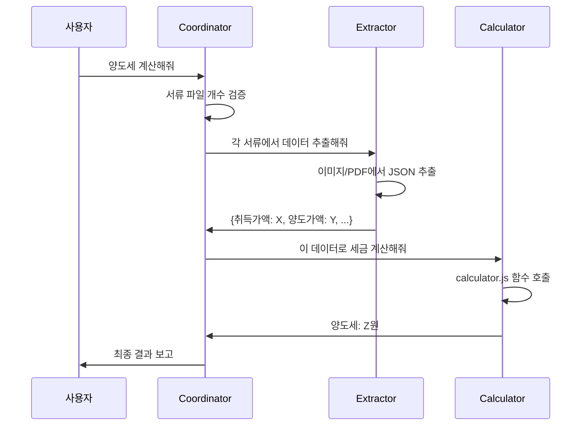

정답 425만원에 "1,000만원"이라고 답하던 AI가, 분업 후 "425만원"을 일관되게 답하게 되었습니다. 이 글은 제로백(Zero100) AI 빌더톤에서 CrewX를 활용해 양도소득세 계산 시스템을 구축한 경험을 바탕으로 작성되었습니다.

<!--truncate-->

**이 글이 도움될 분:**
- LLM의 계산 오류에 지친 개발자
- 멀티 에이전트 시스템을 처음 구축하려는 분
- LangGraph/AutoGen이 복잡하게 느껴지는 분

## 프로젝트 배경

이 프로젝트는 **제로백(Zero100) AI 빌더톤**에서 시작되었습니다.

저는 한국에서 실제로 활동 중인 **현직 세무사**와 팀을 이뤄 프로젝트를 진행했습니다. 세무사님은 양도소득세 계산의 복잡한 실무 로직과 예외 케이스를 알려주셨고, 저는 CrewX를 활용해 이를 멀티 에이전트 시스템으로 구현했습니다.

처음에는 단일 AI 에이전트로 시도했지만, 결과가 매번 달라지는 문제에 부딪혔습니다. 그러다 **3개의 전문 에이전트로 역할을 분리**하자, 같은 팀원들도 놀랄 정도로 정확도가 올라갔습니다.

> "이제 만원 단위까지 같아요! 이게 되네?" — 팀원 반응

이 글은 그 과정에서 배운 **"분업이 정확도를 높인다"**는 핵심 인사이트를 공유합니다.

## TL;DR

| 항목 | 단일 에이전트 | 3개 분업 에이전트 |
|------|-------------|-----------------|
| **정확도** | 최선의 경우 421만원 (정답 425만원) | 만원 단위까지 정확 (425만원) |
| **오답 확률** | 20~30%는 터무니없는 오답 (예: 1,000만원) | 거의 없음 |
| **결과 재현성** | 매번 달라짐 (70~80% 수준) | 99% 일관된 결과 |
| **디버깅** | 어디서 틀렸는지 모름 | 단계별 추적 가능 |

## 문제: 단일 에이전트의 한계

양도소득세 계산은 복잡합니다:
- 취득가액, 양도가액, 필요경비 추출
- 장기보유특별공제 적용
- 세율 계산 및 최종 세액 산출

단일 AI에게 이 모든 것을 맡겼더니:

```
❌ 문제 1: 정보 혼동
   - 취득가액과 양도가액을 헷갈림
   - 여러 서류에서 숫자를 잘못 매칭

❌ 문제 2: 연산 오류
   - LLM이 직접 계산하면 1원 단위가 틀림
   - 복잡한 공제 계산에서 실수 발생

❌ 문제 3: 결과 불일치
   - 같은 질문에도 매번 다른 답변
   - 신뢰할 수 없는 결과물
```

## 해결책: 3개 에이전트 분업 시스템

### 역할 분담



### 1. Coordinator (지휘자)
- **역할**: 전체 워크플로우 관리
- **핵심 원칙**: 직접 계산하지 않음
- **담당 업무**:
  - 서류 파일 개수 검증
  - 다음 에이전트 지정
  - 최종 결과 조합

### 2. Extractor (관찰자)
- **역할**: 비정형 데이터 → 정형 JSON 변환
- **핵심 원칙**: 판단하지 않음 (눈에 보이는 것만 추출)
- **담당 업무**:
  - 이미지/PDF에서 숫자 추출
  - 항목별 분류 (취득가액, 양도가액 등)
  - JSON 형식으로 출력

### 3. Calculator (계산기)
- **역할**: 정확한 세금 계산
- **핵심 원칙**: LLM의 환각 배제, 코드로 계산
- **담당 업무**:
  - `calculator.js` 함수 호출
  - 1원 단위까지 정확한 연산
  - 계산 근거 명시

## 결과: 정확도와 재현성 확보

**정답: 양도세 425만원인 케이스**

### Before (단일 에이전트)
```
1차 시도: 421만원  ← 최선의 경우 (4만원 오차)
2차 시도: 438만원  ← 다른 결과
3차 시도: 1,000만원  ← 터무니없는 오답 (20~30% 확률로 발생)
```
- 70~80%만 어느 정도 근접한 답변
- 20~30%는 완전히 빗나간 오답
- **매번 다른 결과** → 신뢰 불가

### After (3개 분업 에이전트)
```
1차 시도: 425만원  ← 정답
2차 시도: 425만원  ← 동일
3차 시도: 427만원  ← 가끔 2만원 오차
```
- **99% 일관된 결과**
- 만원 단위까지 정확
- 터무니없는 오답 거의 사라짐

**핵심 인사이트**: 각 에이전트가 한 가지 역할만 수행하면서 안정성과 정확도가 비약적으로 향상되었습니다.

## CrewX를 선택한 이유

### 핵심: 3일 만에 분업 에이전트 프로토타입 완성

**3개 에이전트 분업 구조의 프로토타입이 단 3일 만에 나왔습니다.**

이게 CrewX의 진짜 위력입니다:
- Day 1: "분업하면 정확도가 올라갈까?" 아이디어 검증 시작
- Day 2: Coordinator, Extractor, Calculator 역할 분리 + Skills 연결
- Day 3: Slack에서 테스트 → **"이거 되네!"** 확인

**3일이면 "될까 안될까"를 알 수 있습니다.** 안 되면 다른 방법을 시도하면 되고, 되면 그걸 발전시키면 됩니다. 이 빠른 실험 사이클이 결국 성공으로 이어졌습니다.

### LangGraph로 같은 걸 만들었다면?

솔직히 **3일 만에 프로토타입?** 불가능에 가깝습니다.

```
Day 1: LangChain 문서 읽기... 그래프 이론 이해하기...
Day 2: Tool 스키마 정의... Pydantic 에러...
Day 3: 아직 첫 번째 에이전트도 안 돌아감
Day 4-7: 겨우 단일 에이전트 작동
Day 8-14: 3개 에이전트 연결 시도... 상태 관리 복잡...
Day 15+: 서버 배포... Docker 설정... API 엔드포인트...
```

**2주 지나서야 "될까 안될까"를 알 수 있습니다.** 그때 안 되면? 2주를 날린 거죠.

### 전체 개발 기간: 3주 만에 프로덕션 수준 달성

이 프로젝트는 **제로백 빌더톤 3주** 동안 완성했습니다:
- Week 1: 아이디어 검증 + 분업 프로토타입 (3일) + 피드백 반영
- Week 2: Skills 고도화 + Slack Bot 연동 + 세무사님 테스트
- Week 3: 정확도 튜닝 + 발표 준비

**CrewX 덕분에 첫 주에 이미 "이거 된다"를 확인**하고, 남은 2주는 완성도를 높이는 데 집중할 수 있었습니다.

### CrewX Skills: Tool Call의 혁신

LangGraph에서 Tool Call을 구현하려면:

```python
# LangGraph: Tool 정의만 해도 이렇게 복잡
from langchain.tools import tool
from pydantic import BaseModel, Field

class TaxCalculatorInput(BaseModel):
    acquisition_price: int = Field(description="취득가액")
    transfer_price: int = Field(description="양도가액")
    holding_years: int = Field(description="보유 기간")
    # ... 수십 개의 필드 정의

@tool
def calculate_tax(input: TaxCalculatorInput) -> dict:
    # 복잡한 계산 로직...
    # 에러 핸들링...
    # API 서버에 배포...
    pass

# 그래프에 연결하는 코드...
# 에러 핸들링 레이어...
# 재시도 로직...
```

**CrewX Skills는 마크다운 파일 하나로 끝:**

```markdown
# skills/tax-calculator/SKILL.md
---
name: tax-calculator
description: 양도소득세 계산 스킬
---

## 사용법
calculator.js의 함수를 호출하여 정확한 세금을 계산합니다.
LLM이 직접 계산하지 말고, 반드시 이 스킬을 사용하세요.
```

```javascript
// skills/tax-calculator/calculator.js
function calculateTax(acquisitionPrice, transferPrice, holdingYears) {
  // 1원 단위까지 정확한 계산
  return result;
}
```

**끝.** 서버 배포 없이, 로컬에서 바로 테스트하고 Slack으로 즉시 연동.

### 개발 시간 비교

| 항목 | LangGraph | CrewX |
|------|-----------|-------|
| **Tool/Skill 하나 추가** | 반나절~1일 (스키마, 에러처리, 배포) | **30분** (마크다운 + JS) |
| **프로토타입** | 2~4주 | **2~3일** |
| **프로덕션 수준** | 1~3개월 | **1~2주** |
| **수정 후 테스트** | Docker 리빌드 대기... | **즉시** (로컬 실행) |

### 학습 곡선 비교

| 항목 | LangGraph | CrewX |
|------|-----------|-------|
| **대상** | 전문 개발자 (Python 필수) | **비개발자도 가능** |
| **선행 지식** | LangChain + 그래프 이론 + 상태 관리 | YAML 문법만 |
| **초기 진입** | 1~2주 학습 필요 | **30분 튜토리얼** |
| **프로덕션 숙련** | 2~3개월 | **1~2주** |
| **디버깅** | 추상화 레이어 때문에 어려움 | **단계별 추적 가능** |

실제로 이 프로젝트에서 **세무사님도 Slack에서 직접 에이전트를 테스트**하고 피드백을 주셨습니다. LangGraph였다면 "코드 수정해서 다시 배포해주세요"라고 요청해야 했겠죠.

### API 비용 비교

| 시나리오 | LangGraph (직접 API 호출) | CrewX (기존 구독 활용) |
|----------|--------------------------|---------------------|
| **월 100회 사용** | $50~150/월 (API 비용) | **$0 추가 비용** |
| **월 1,000회 사용** | $500~1,500/월 | **$0 추가 비용** |
| **Claude Code 구독** | - | 이미 보유한 구독 그대로 |

**핵심 차이점**:
- **LangGraph**: API 키 발급 → 사용량 비용 증가 → 서버 배포 필요
- **CrewX**: 기존 Claude Code/Gemini 구독 그대로 → 추가 비용 없음 → 로컬에서 바로 실행

## CrewX의 핵심 가치

### 1. 기존 구독 활용 (BYOA: Bring Your Own AI)
```bash
# 이미 갖고 있는 AI 구독을 그대로 사용
crewx q "@claude:sonnet 양도세 계산해줘"
crewx q "@gemini:flash 서류 검토해줘"
```

### 2. 30분 만에 멀티 에이전트 구축
```bash
# 1. 설치
npm install -g crewx

# 2. 설정 (crewx.yaml 작성)
crewx init

# 3. 바로 사용
crewx q "@coordinator 양도세 계산 시작"
```

### 3. Slack 팀 협업 즉시 가능
```bash
crewx slack --log
# Slack 채널에서 @coordinator, @extractor 등 바로 호출
```

## 마무리: 분업이 정확도를 높인다

### 핵심 교훈
1. **단일 에이전트의 한계**: 모든 것을 한 AI에게 맡기면 정보 혼동과 연산 오류 발생
2. **분업의 힘**: 각 에이전트가 한 가지 역할만 수행하면 정확도와 재현성 향상
3. **도구 선택의 중요성**: LangGraph는 강력하지만 학습 곡선이 가파르고 추가 비용 발생

### CrewX를 선택해야 하는 이유
- **빠른 개발**: YAML 설정만으로 멀티 에이전트 시스템 구축
- **비용 절감**: 기존 AI 구독(Claude Code, Gemini) 그대로 활용
- **낮은 진입 장벽**: 30분 튜토리얼로 시작 가능
- **팀 협업**: Slack 통합으로 즉시 협업 가능

## 지금 시작하기

**5분 안에 첫 멀티 에이전트 시스템을 만들어보세요.**

```bash
# 1. 설치
npm install -g crewx

# 2. 초기화
crewx init

# 3. 에이전트 확인
crewx agent ls

# 4. 바로 사용
crewx q "@claude 안녕하세요"
```

**더 알아보기:**
- [GitHub](https://github.com/crewx-dev/crewx) - Star로 응원해주세요!
- [공식 문서](https://crewx.dev) - 상세 가이드

## Coming Soon: CrewX Cloud

**"YAML로 만든 에이전트를 프로덕션에 배포하고 싶다면?"**

2026년 3분기, **CrewX Cloud**가 출시됩니다.

```bash
# 로컬에서 완성한 에이전트를 한 줄로 배포
crewx deploy -c crewx.yaml

# 끝. API 엔드포인트가 자동으로 생성됩니다.
# https://api.crewx.dev/agents/coordinator
```

**더 이상 Docker, AWS, API Gateway 설정에 시간 낭비하지 마세요.**

YAML로 에이전트를 정의하고 → 로컬에서 테스트하고 → `crewx deploy` 한 줄로 프로덕션 배포.

지금 CrewX로 시작하시면, Cloud 출시 때 바로 배포할 수 있습니다.

---

*이 글은 제로백(Zero100) AI 빌더톤에서 CrewX를 활용해 양도소득세 계산 시스템을 구축한 경험을 바탕으로 작성되었습니다. 실제로 현직 세무사와 협업하여 **만원 단위까지 정확한 계산**과 **99% 일관된 결과**를 달성했습니다.*
